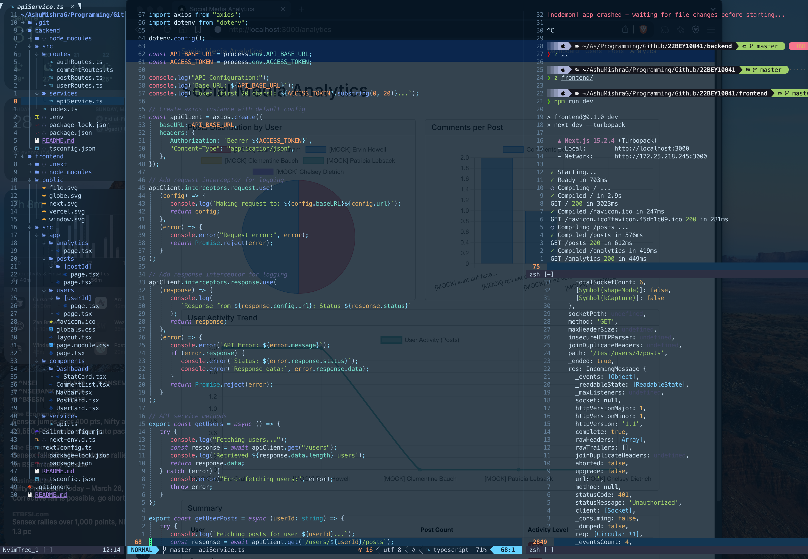
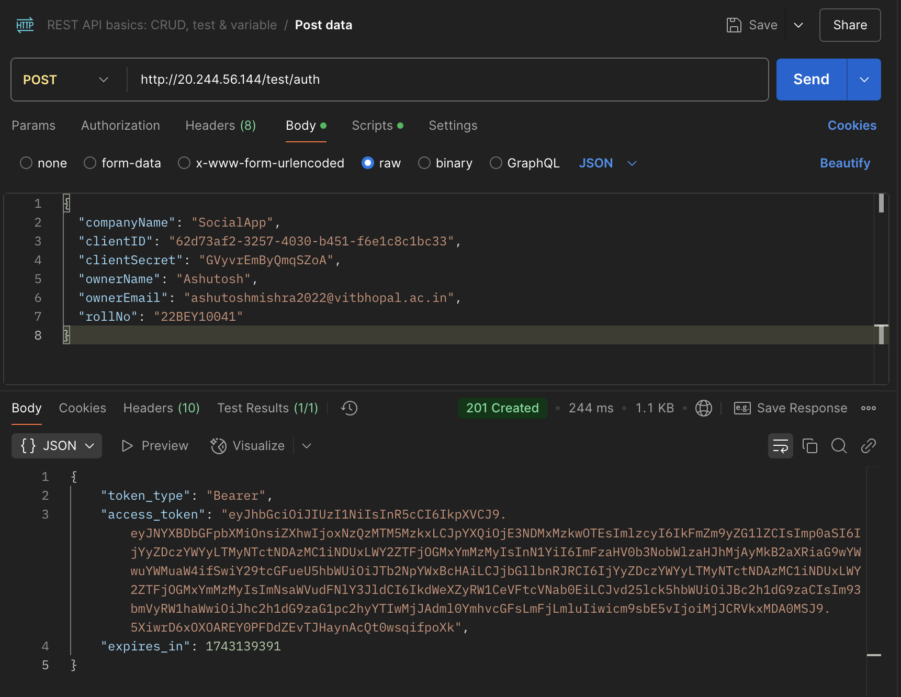

# Social Media Analytics Platform

A comprehensive social media analytics platform that allows users to analyze and visualize data from social media APIs.

## Project Overview

This project consists of two main components:

1. **Backend**: A Node.js/Express API service that acts as a middleware to communicate with the social media API
2. **Frontend**: A Next.js application that provides a beautiful and intuitive user interface


## Screenshots





## Project Structure

```
22BEY10041/
├── backend/              
│   ├── src/             # Source code
│   │   ├── routes/      # API routes
│   │   ├── services/    # External API integrations
│   │   └── index.ts     # Entry point
│   ├── .env             # Environment variables
│   ├── package.json     # Dependencies
│   └── tsconfig.json    # TypeScript configuration
│
├── frontend/            
│   ├── src/            # Source code
│   │   ├── app/        # Next.js app router pages
│   │   ├── components/ # Reusable UI components
│   │   └── services/   # API services
│   ├── public/         # Static assets
│   ├── package.json    # Dependencies
│   └── next.config.ts  # Next.js configuration
│
└── README.md            # Project documentation
```

## Getting Started

### Prerequisites

-  Node.js 18.0.0 or higher
-  npm or yarn

### Installation

1. Clone the repository:

   ```bash
   git clone https://github.com/AshuMishraG/22BEY10041.git
   cd 22BEY10041
   ```

2. Backend setup:

   ```bash
   cd backend
   npm install
   cp .env.example .env  # Create and configure .env file with API credentials
   npm run dev
   ```

3. Frontend setup:

   ```bash
   cd frontend
   npm install
   npm run dev
   ```

4. Access the application:
   -  Backend API: http://localhost:5001
   -  Frontend: http://localhost:3000

## API Documentation

### Authentication

-  `GET /api/auth/info` - Get authentication info
-  `GET /api/auth/token` - Get access token

### Users

-  `GET /api/users` - Get all users
-  `GET /api/users/:userId/posts` - Get posts by user ID

### Posts

-  `GET /api/posts/:postId/comments` - Get comments for a post

## Technologies Used

-  **Backend**:

   -  Node.js
   -  Express
   -  TypeScript
   -  Axios

-  **Frontend**:
   -  Next.js
   -  React
   -  Bootstrap
   -  Chart.js
   -  TypeScript